# � DivyaPath
### Real-Time Idol Tracking & Crowd Monitoring System

**DivyaPath** is a next-generation "Live Google Maps" for large-scale festivals (like Jagadhatri Visarjan). It provides real-time visibility into the location of idols, crowd density, and safety monitoring.

It connects **volunteers on the ground** with **administrators in the control room** and **visitors planning their route**, ensuring a safer and smoother festival experience.

---

## 🏛️ System Architecture

The system is built on a high-throughput **Event-Driven Architecture** designed to handle thousands of concurrent updates.

```mermaid
graph TD
    A[📱 Volunteer App] -->|BLE Scans + GPS| B(🚀 Ingestion API)
    B -->|Raw Events| C{Kafka Message Bus}
    
    subgraph "Stream Processing Core"
    C -->|Topic: volunteer_tracking| D[⚡ Apache Flink]
    D -->|Triangulation Logic| D
    end
    
    D -->|Live Coordinates| E[(Redis Cache)]
    D -->|Historical Paths| F[(MySQL Database)]
    
    subgraph "Presentation Layer"
    E -->|WebSockets| G[🖥️ Admin Dashboard]
    E -->|API Polling| H[🗺️ Visitor Map App]
    end
```



---

## 🧩 Key Components

### 1. 📱 Volunteer App (The Sensors)
*   **Role**: Acts as a moving scanner using the crowd's smartphones.
*   **Function**: Scans for BLE Beacons attached to Idols and uplinks the data + GPS location.

### 2. 🚀 The Backend (Ingestion & Buffer)
*   **Tech**: FastAPI, Apache Kafka.
*   **Role**: Receives high-frequency data bursts from thousands of phones and buffers them into Kafka topics securely and efficiently.

### 3. 🧠 Stream Engine (The Brain)
*   **Tech**: Apache Flink.
*   **Role**: 
    *   **Triangulation**: Correlates multiple volunteer scans to pinpoint the Idol's exact location.
    *   **Heatmaps**: Calculates crowd density in real-time windows.
    *   **Alerting**: Detects if an idol is stationary for too long (bottleneck detection).

### 4. 🗺️ The Frontend (Live Maps)
*   **Admin Dashboard**: A command center view with live movements, heatmaps, and system health.
*   **Visitor App**: A simplified map mostly for viewing Idol locations and planning routes to avoid crowds.

---

## � Features

### ✅ Feature 1: Live Idol Tracking
Real-time marker movement on the map. We don't just show raw GPS; we process signals to show where the *Idol* actually is, even if the volunteer moves away.

### ✅ Feature 2: Crowd Heatmaps
Dynamic overlays showing high-density zones. This helps authorities deploy resources to manage crowd flow before it becomes dangerous.

### ✅ Feature 3: Smart Routing
Visitors get "Time to Reach" estimates based on current crowd congestion, not just distance.

### ✅ Feature 4: Admin Analytics
Post-event playback and analysis to understand flow patterns and improve planning for next year.

---

## 🛠️ Technology Stack

| Component | Technology |
|:---|:---|
| **Backend API** | Python, FastAPI, Uvicorn |
| **Message Broker** | Apache Kafka |
| **Stream Processing** | Apache Flink (Java/Python) |
| **Real-time DB** | Redis (Pub/Sub & Caching) |
| **Storage** | MySQL (Historical Data) |
| **Frontend** | React, Mapbox GL / Google Maps API |
| **Mobile** | Flutter / React Native (BLE Module) |

---

## ⚡ Getting Started

This repository currently hosts the **Backend & Ingestion Layer**.

1.  **Clone the Repo**
    ```bash
    git clone https://github.com/asmit383/Divyapath.git
    cd Divyapath
    ```

2.  **Run Services (Docker)**
    ```bash
    docker-compose up -d zookeeper kafka redis mysql
    ```

3.  **Start Backend**
    ```bash
    pip install -r requirements.txt
    uvicorn main:app --reload
    ```

---
*DivyaPath — Guiding the way, safely.* 🕉️
